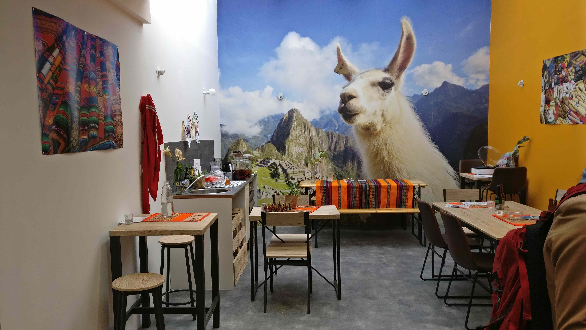

Bonjour à toi, camarade de quelques minutes de lecture. Aujourd'hui, je te plonge dans un royaume que l'on connaît tous, seulement dans notre imaginaire collectif, mais qui présente pourtant les mêmes pouvoirs d'oppression que son homologue réel. Ça t'intrigue, n'est-ce pas ? Loin de moi l'idée de partir dans une fiction délirante, je vais te parler d'autorité. Allez, avoue que tu es un peu déçu. Tu peux t'arrêter là si tu veux, mais ce serait dommage de ne pas embarquer dans ce monde fictif sur lequel j'ai plein de choses à te dire. Peu importe la manière de la désigner, _règles, répression, conduite_, elle ne te rend pas la vie facile. Elle est pourtant si essentielle à notre société. Mais finalement, l'autorité, qu'est-ce que c'est ?

La question est vaste, cher ami. Et autant te dire que vu mon bagage en philosophie, ça va se limiter au niveau du comptoir de ton bistrot préféré. Attends, tu n'as pas de bistrot préféré ? Tout poivrot qui se respecte en a un. Ah pardon, tu n'as pas de problème d'alcool. Autant pour moi. Santé quand même, camarade.

## Notre éveil à l'autorité

Commençons par un petit exercice. Essaie de te rappeler tes tous premiers rapports à l'autorité. Même si le souvenir est sûrement vague, ça ressemble sûrement à une tape sur les doigts après avoir attrapé quelque chose d'interdit, n'est-ce pas ? Un petit air d'Adam et Ève, finalement. S'en suit quelque chose que tu connais probablement par cœur, la punition. Petit·e polisson·ne que tu es.

C'est sévère, la punition. Quand on est enfant et qu'on n'a aucune notion des interdits, on peut la considérer légitime. Ne pas crier, ne pas chahuter à l'intérieur, ne pas traverser la rue n'importe où... une montagne de contraintes auxquelles ta version miniature doit se plier et ce sans trop savoir pourquoi au départ, d'ailleurs.

Puis on fait l'expérience du monde qui nous entoure. On se casse la gueule, d'abord au sens littéral, puis de manière plus subtile et détournée. Si l'on est suffisamment curieu·x·se, on accepte l'autorité naturelle des choses, qui réside dans le fait qu'interagir de telle ou telle manière avec notre environnement nous évite (ou non) des déconvenues. C'est un siècle entier, pour les plus chanceux d'entre-nous, d'analyse, en essayant tant bien que mal de donner un sens à notre vie. Cette autorité naturelle va aussi régir une bonne partie de nos rapports sociaux. Si tu réveilles ta voisine de palier en pleine nuit en écoutant Céline Dion (et son mari René, paix à son âme) à fond, peu de chances qu'elle t'invite à la prochaine fête des voisins. Mis à part si tu es Céline Dion, mais permets-moi d'en douter.

Au final, peu importe les règles que nos contemporains nous fixent, nous avons définitivement besoin de preuves concrètes pour justifier leur raison d'être.

## L'école

À peine confronté à l'autorité parentale qu'on en découvre une nouvelle forme, incarnée par _l'école_. Si quelque chose nous unit, nous petits soldats d'Occident, c'est bien ces heures passées sur une chaise de bureau devant l'institut·eur·rice. Au départ, c'est surtout une obligation, comme beaucoup de règles que nous imposent nos parents. Ce que l'on préfère, il faut l'avouer, c'est chahuter avec les cop·ains·ines dans la cour, et s'asseoir sur la table de la cuisine pour le goûter de 4 heures quand la sonnerie retentit. Autour de ce joli théâtre s'installent beaucoup de nouvelles contraintes à notre quotidien, auxquelles on se plie sans trop les remettre en cause. Elles nous apprennent que l'on ne fait pas toujours ce que l'on veut dans la vie, même si l'on est encore loin de comprendre les impératifs des adultes.

L'arrivée de l'adolescence nous envoie sur les rails du collège et tout ce qui s'en suit, marquant le début d'un long cheminement qui mènera pour la plupart d'entre nous jusqu'au bac. Ah le bac, ce précieux sésame. Mention _Très Bien_ qu'il a eu, ce petit con en train de t'écrire. Petit élève modèle qui a toujours été félicité par l'autorité, tout paraît tracé pour mener une vie réussie, n'est-ce pas ? Bon pas vraiment, en fait.

En fin de compte, qu'est-ce qui caractérise l'élève modèle ? On le sait tous, de bons résultats dans toutes les matières, une discipline exemplaire, et un peu plus tard quelques notions d'organisation du travail. Tout n'est pas à jeter dans tout ça, bien au contraire, mais est-ce que l'on se donne toute cette peine pour soi ? Pour la plupart d'entre-nous, c'est un mélange entre _Il faut que j'aie de bons résultats pour pouvoir accéder au métier de mes rêves_ (quand les parents n'influent pas trop sur le choix de ce métier), et une peur de l'autorité incarnée par le corps enseignant. Dans le fond, ce qu'on nous enseigne dépasse rarement le cadre théorique.

La théorie demande des capacités d'abstraction et de concentration que tout le monde n'a pas. Certaines personnes, au contraire, ont énormément souffert pendant leur période scolaire. Pour celles-ci, l'école s'apparente à un enfer d'esquives, de tentatives ratées, d'activités inintéressantes et surtout une force implacable contre laquelle on lutte, un _rocher de [Sisyphe](https://fr.wikipedia.org/wiki/Sisyphe)_ qui nous sanctionne en permanence.

Malgré toutes les vertus que l'on peut admettre au sujet de notre système éducatif, sur lesquelles je ne crache en aucun cas, c'est bien souvent beaucoup d'interrogations et d’inquiétudes qui en résultent. Combien de fois as-tu entendu _Mais à quoi ça va nous servir, cette connerie?_, les maths souvent en bouc émissaire ? Le raccourci peut paraître grossier, mais tout raccourci a une raison d'être. Tu auras probablement deviné laquelle.

## Et après ?

Ça y est, si tout s'est bien passé, tu as ton diplôme. Tu sors tout frais et content d'abandonner ces séries d'examens, pendant lesquels on te demande essentiellement de deviner ce que le prof attend de toi. On peut, finalement, être arrivé jusqu'ici sans avoir cherché à donner un sens à nos agissements. _Pourquoi devrais-je faire ceci ?_ Jusque là, c'était pour un diplôme mais maintenant qu'on a ce foutu diplôme, qu'en fait-on ? Une petite ligne en plus sur le CV ?

Je suis plutôt bien placé pour parler, puisque je suis passé par là encore tout récemment et comme toute personne autour de la vingtaine, je m'interroge intensément sur cette quête de sens. À ce stade, on peut selon moi adopter deux postures. La première, que j'affectionne particulièrement, consiste à dire qu'étant donné le petit papier, la petite étiquette sur notre poche de chemise, le papier toilette avec lequel on se torche ou je ne sais quel objet ostentatoire, on doit nous écouter, obéir à nos ordres et nous récompenser comme il se doit. J'ai eu ce diplôme, donc on me doit du respect, un joli bureau, un fauteuil confortable, un bon salaire, une belle maison, et l'aboutissement de tout, une _Rolex_. Parce qu'on sait tous que la _Rolex_ fait fonctionner l'usine. On sait aussi que la _Rolex_ nous apporte notre repas à domicile avec le sourire, vient nous dépanner en cas de fuite d'eau ou nous divertit le Samedi soir en chantant gaiement dans un café concert.

Merde, j'ai cravaché pendant toutes ces années à l'école, j'ai réussi les concours, je mérite d'être ici ! Maintenant, je dois avoir de la reconnaissance ! Où est-ce qu'il est passé le directeur de l'école, avec son discours élogieux à la remise des diplômes ? Attends, c'est pas ce petit _manard_ issu d'une école de milieu de classement _l'Etudiant_ qui va venir me donner des conseils, quand même. Pourquoi lui donner des responsabilités ? J'ai beau essayer de mettre mon diplôme dans le scanner, le cahier des charges n'en sort pas tout cuit. Peut-être que je sais juste cuisiner des pâtes, finalement.

Personnellement, je suis plutôt de ceux qui considèrent que l'autorité s'acquiert. Et cette acquisition passe obligatoirement par le concret, la pratique. Celle qui vérifie la théorie. On a beau théoriser pendant des heures que le pain cuit à 210°C et qu'il faut 20 g de levure pour faire deux baguettes, il va falloir le pétrir. Il va falloir le laisser reposer plusieurs heures pour laisser les levures agir tranquillement. Il va falloir l'inciser et surveiller la cuisson. Toute une suite de petits ajustements qui complémentent l'expérience. Tu admettras facilement qu'on prévoit rarement toutes les embûches qui peuvent se dresser en chemin. Bon, j'ai peut-être pas pris l'exemple le plus sensationnel pour parler d'embûches mais tu as saisi l'idée, petit·e ingrat·e.

## Mais alors, je commence par le bas ?

Eh oui, il va falloir te _rabaisser_ si tu te sentais déjà très haut à la sortie de l'école. Pour moi aucun problème, étant proche du nanisme. Je vais de ce pas m'auto-flageller pour cette blague médiocre.

Allez, revenons à nos moutons apprentis. Ne serait-il pas plus judicieux d'accorder un poids important à l'opinion des personnes qui se sont déjà confrontées, parfois à maintes reprises, à la tâche que l'on s'apprête à accomplir avec eux ? Eux savent mieux que personne d'autre la démarche à suivre. Ils n’œuvrent pas forcément à la perfection, mais ont le souci de tendre vers celle-ci.

Selon l'intérêt de chacun, nos affects et notre personnalité, on s'oriente instinctivement vers ce qui nous parle. Pour organiser un festival, certains vont vouloir se charger de la logistique. D'autres, qui ont horreur des chiffres et de l'organisation, vont s'atteler à communiquer autour de l'événement ou concevoir une affiche aux petits oignons. Et si le festival ne tombe pas à l'eau, parfois au sens propre avec les pluies diluviennes, chacun tirera des leçons de cette expérience. Peut-être que des tensions se feront sentir pendant la préparation. Probable aussi que des disputes éclatent, mais n'est-ce pas une étape incontournable ? Ne faisons pas les autruches.

On a fait quelques choses de nos mains, qui a rassemblé du monde autour de la musique. Les personnes les plus expérimentées ont transmis leur savoir aux plus _apprentis_. Les bleus ont appris et reviendront. On gardera l'_ingé' son_, parce que c'est lui qui sait mieux que personne positionner les haut-parleurs, caissons de basse et autres objets bruyants qui mettront la foule en liesse. On écoutera _Daniel_, le responsable technique, qui fait toujours en sorte que tous les concerts s'enchaînent sans retard en coordonnant les artistes et les musiciens. Il a aussi dirigé toute la troupe de bénévoles pour la collecte des déchets, l'installation des festivaliers sur le camping et la mise en place des sanitaires. Par ses ouvrages et souvent au prix de bien des sacrifices, il a acquis une confiance légitime auprès de ses partenaires.

Ainsi se dessine cette nette bifurcation, que tu as sûrement déjà constatée, entre les "petits chefs" qui s'efforcent d'imposer leurs décisions à leurs _N-1_, et les personnes que je qualifierais simplement de _crédibles_. Celles qui se sont réellement écorché les genoux à tendre vers un travail au-delà de toutes les attentes que l'on leur avait imposé au départ.

Et toi, estimes-tu que l'on t'écoute à ta juste valeur ? As-tu encore des efforts à fournir pour te sentir légitime ? Moi oui, assurément, et comme tout le monde je pense. Il est vrai que certaines personnes n'en feront qu'à leur tête dans tous les cas, et c'est bien dommage. N'est-ce pas peine perdue de nager à contre-courant en essayant de les convaincre ? Je fais partie de ceux qui pensent que, si l'on accorde un minimum de soin et de conscience commune à ce que l'on réalise, nos pairs y seront sensibles.

Il me paraît essentiel de se rapprocher, dans ce cheminement, des personnes qui entreprennent des projets qui nous parlent et nous motivent. À partir de là tout reste à faire, mais les fondations sont posées. Le résultat n'est qu'un indicateur des prochains ajustements à faire, comme un sondage des capacités actuelles de l'équipe. L'être humain est fondamentalement imparfait, et c'est cette volonté d'oeuvrer pour toujours plus de qualité, aussi subjective que sa mesure puisse être, qui nous habite au quotidien. _Ça a fonctionné. D'autres fois, non._ Par contre ne pars pas à l'échafaud tout de suite, tout n'est pas à jeter. Et si certaines choses le sont, n'oublie pas de mettre les cartons dans le bac recyclage.
