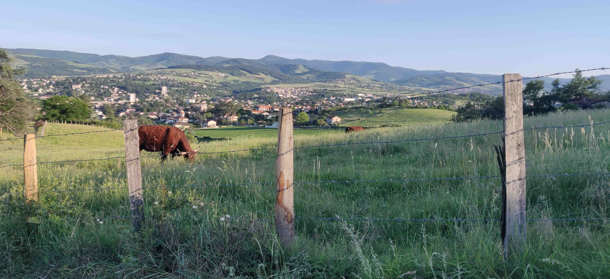
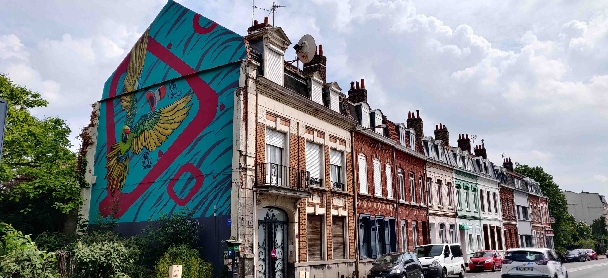
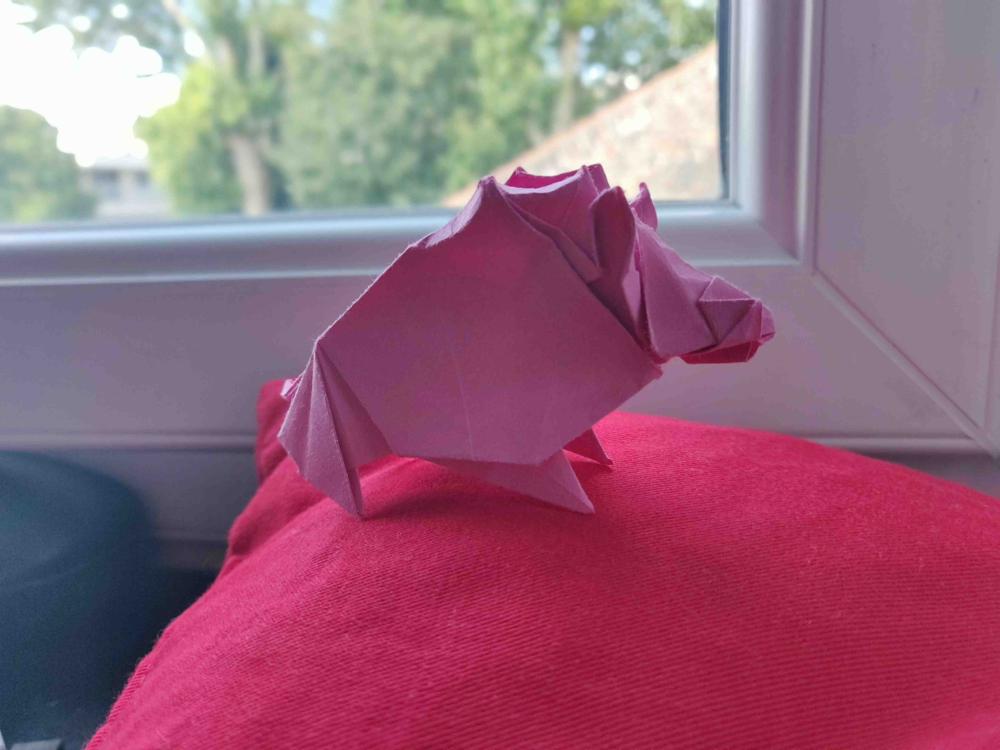

Salut l'ami·e. Comment vas-tu ? Sais-tu comment tu iras dans deux jours ? Dans deux mois, deux ans ? Ça y est, à peine tu as commencé à lire que tu es déjà assailli·e de questions. C'est incroyable, quand même. À vrai dire, personne ne sait vraiment ce que l'avenir lui réserve, peu importe le degré d'optimisme. C'est bien ce qui fait la saveur de la vie. Au fond de nous, nous cherchons tous l'accomplissement. Cet objectif à long terme contraste souvent avec nos désirs et pulsions à court terme qui, bien qu'elles nous apaisent et nous soulagent temporairement, ne nous avancent pas d'un pouce dans cette quête.

Dans un monde dans lequel _vitesse_ est le maître mot, on dirait que nous cherchons en permanence à nous affranchir du _facteur temps_. Il sera pourtant toujours présent dans notre vie, de par notre nature périssable et nos interactions avec le vivant. Les cerises poussent en été. Une fois l'été passé, il faut attendre l'année prochaine pour que les nouvelles pointent le bout de leur nez. _Patience_ est donc un autre maître mot à apprivoiser. Pourquoi donc toujours devoir faire preuve de patience, me diras-tu ? L'un des _credo_ du progrès technologique est de ménager cette faculté pour justement _gagner_ du temps. Mais gagner du temps pour quoi, au juste ? Une heure de plus au bureau ? Une heure de shopping le week-end ?

Tu tomberas sûrement d'accord avec moi sur le fait que notre temps est précieux. On aimerait pouvoir toujours le mettre à profit pour des causes qui comptent pour nous. Les paperasses, les tâches routinières, les conversations anodines sont souvent réduites au strict nécessaire, par les moyens dont nous disposons (numérisation, commandes à distance de nourriture, transports ultra-rapides...). Nous avons pu supprimer la redondance et l'attente dans nos réflexions quotidiennes, mais doit-on pour autant chercher à nous en débarrasser totalement ? C'est sur cette question-là que je t'amène à réfléchir à travers ces lignes.

## Apprentissage, répétition

Si tu me lis actuellement, c'est probablement que tu as _appris à lire_. Merci Sherlock, me diras-tu. Ce à quoi je te répondrai _va te faire foutre_, parce que je suis très susceptible. Mais je m'emporte. Revenons à notre sujet.

Tu as donc, probablement entre tes 6 et 10 ans, appris à lire. Selon ton âge, ces souvenirs peuvent sembler lointains. Ceux-ci t'évoquent sûrement des heures et des heures passées devant un manuel de lecture, à lire à tour de rôle sous les ordres de l'instituteur·rice.

Aujourd'hui, c'est presque un 6ème sens. Pour les occidentaux que nous sommes, ayant bénéficié d'une éducation gratuite et obligatoire, c'est même devenu une aptitude indispensable au risque de nous retrouver en marge de la société. Cela n'enlève rien au fait que nous avons toutes et tous _lu_, _lu_ et _relu_, page après page, afin de développer une faculté presque naturelle à dévorer les mots. C'est un processus marqué au fer rouge dans notre inconscient, spontané, qui nous demande dorénavant très peu de ressources intellectuelles.

J'ai choisi cet exemple car, finalement, tout apprentissage fonctionne ainsi. Si demain tu as envie d'apprendre à faire du surf, il te faudra sûrement plusieurs semaines, mois ou années avant même de pouvoir prendre du plaisir sur la vague comme notre cher _Brice_. La saveur s'en trouve d'ailleurs décuplée par le sentiment d'avoir oeuvré d'arrache-pied pour acquérir l'équilibre nécessaire, d'avoir laissé ton cerveau s'adapter (merci la plasticité) et enfin par le plaisir de glisser sur la vague.

Malheureusement, nous avons toutes et tous tendance à perdre, en grandissant, cet appétit pour l'apprentissage. Je pense que notre monde _ultra-rapide et connecté_ a sa part de responsabilité dans l'affaire : toujours plus d'immédiat pour notre dose journalière de dopamine. C'est comme lorsqu'on tombe dans le paquet de _Dragibus_ sans jamais pouvoir en sortir. Et après coup, comme souvent, on regrette.

## Moralité

Nous passons toutes et tous du temps sur des activités à caractère _divertissant_. C'est d'ailleurs indispensable à notre épanouissement. Rire, passer de bons moments entre amis, manger un bon plat, se balader, tout cela contribue à notre bien-être et ce serait mentir à nous-mêmes que de vouloir être toujours productif·ve, en cherchant frénétiquement _l'utilité à long terme_ dans nos actes.

Je perçois les loisirs et et les bons moments de la même manière que la sauce piquante sur la pizza. Ou la cerise sur le gâteau. Mais ça, c'est vu et revu donc laisse-moi être original s'il te plaît. Donc de la sauce piquante. En un peu moins fort, parce que je suis un peu fragile. Le bon temps apporte la touche finale à notre existence, nous permet de révéler sa saveur mais n'a pas lieu d'exister indépendamment des bases sur lesquelles nous le mobilisons.

C'est précisément pourquoi j'estime que tendre vers un _affranchissement de la variable temps_, pour toujours plus de divertissement dans notre vie, est une vision très réductrice de notre existence. C'est justement l'action du temps qui nous construit et donne du sens aux projets que nous entreprenons. C'est grâce à une multitude d'actions, dans une direction qui nous est propre, qu'au fil des jours, semaines, mois et années nous apportons des pierres à un plus grand édifice, celui du sens de notre vie. Les contours ne sont pas toujours bien dessinés au départ, mais c'est cette volonté de mettre le coeur à l'ouvrage sur le long terme qui va venir les préciser.

Chaque pierre posée nous rapproche de notre _Légende Personnelle_, pour reprendre les mots du berger andalou de _l'Alchimiste_ (roman de _Paulo Coelho_). Pour y parvenir, je ne vois pas d'autre attitude possible que d'accepter le _temps long_. Dansons avec lui, faisons-lui confiance afin qu'il nous révèle, petit à petit, des indices sur la voie de notre quête existentielle.

