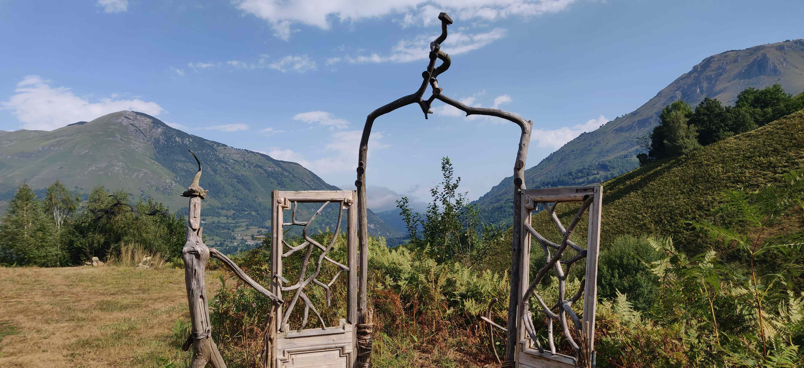

Salut à toi, jeune aventurier·ère. J'espère que tu te portes bien. Je ne me fais pas trop de souci pour ça, étant donné que tu es là en train de me lire. Que demander de plus ? Ne commence pas à faire le·la difficile.

Tu es déjà en train de te dire que ce début de mois de septembre, la deuxième vague de Covid, les gilets jaunes ou simplement le soleil du Nord, m'ont ravagé le cibouleau. Chose pas forcément si éloignée de la réalité j'en conviens, mais toujours est-il que j'ai encore des choses à te dire aujourd'hui. Intéressons-nous à la question de l'influence. Allez hop on s'y plonge direct, ne perdons pas de temps.

## Une vie construite autour des influences

Drôle de sujet, n'est-ce pas ? Qu'est-ce que l'influence ? Est-elle fondamentalement bonne ou mauvaise ? Sorti de son contexte, difficile de faire exister ce terme. Des expériences d'influence nocive te sont peut-être venues à l'esprit : un·e boss tyrannique, des parents envahissants, une compagne ou un compagnon jalou·x·se, un·e ami·e qui te paye un "dernier" verre... ou d'autres plus subtiles comme la presse, les médias, l'éducation parentale ou la culture.

On pourrait continuer encore longtemps. Tu es mieux placé·e que moi pour connaître les principales influences qui s'exercent sur toi, bien que certaines puissent échapper à ton libre arbitre. Il est souhaitable pour nous de discerner les influences qui ont lieu d'être et, au contraire, celles qui ne sont pas légitimes d'exercer une quelconque pression sur nous. C'est d'ailleurs valable dans les deux directions : personne ne peut se targuer de n'avoir aucune influence sur quiconque. Difficile de trouver un exemple de projet dont l'objectif, ou la mise en œuvre, ne suppose pas un jeu d'influences mutuelles. À part un devenir ermite, à la rigueur. C'est ça ton plan devenir ermite, c'est ça ?

Je pense qu'une lecture cohérente des influences réside dans l'impact de leurs conséquences. On peut exercer une influence sur nous-mêmes en prenant des décisions pour notre bien, assisté·e·s par notre instinct de survie. Faire les bons choix pour conserver une bonne santé. Entretenir et décorer sa maison pour se sentir bien chez soi. Questionner régulièrement ses prises de position. Des actions simples que nous faisons tous les jours et qui n'engagent que nous.

## Les influences, une histoire d'humilité ?

Croire que l'Homme peut, par l'ensemble de ses choix, s'éloigner de toute contrainte est évidemment illusoire : être en capacité d'influer sur des aspects de notre vie ne nous protège pas pour autant de ses aléas. Un problème de santé n'est pas nécessairement provoqué par des mauvaises habitudes, sans parler des handicaps survenus à la naissance pour les plus malchanceu·x·ses d'entre-nous. Si l'on pouvait stopper les raz de marée et les ouragans, ça se saurait, tu ne penses pas ? Tout comme être invulnérable aux mauvaises chutes ou au choc d'une voiture qui nous renverse. À une séparation ou la perte d'un·e proche. Un peu déprimant tout ça, n'est-ce pas ?

Pourtant, nous y avons toutes et tous été confronté·e·s sans pouvoir prévenir quoi que ce soit et, à priori, ces événements malheureux sont voués à se reproduire jusqu'à notre dernier souffle. J'aime les comparer au fait d'avoir le vent dans la face en vélo. On ralentit, on stagne, on recule parfois (plus technique, mais j'imagine que ça doit être possible), mais si l'on continue à pédaler et que l'on compose avec les moyens du bord, force est de constater que l'on aura la satisfaction de ne rien avoir à regretter. Et souvent, en prime, de nous en être admirablement sorti·e. La bonne attitude semble être d'accepter que la catastrophe est advenue. Chose paraissant triviale mais pourtant difficile à admettre pour notre nature humaine, naturellement plus encline à se représenter des événements qui surviennent fréquemment.

Se lamenter sur son sort n'a jamais avancé personne. Même dans la pire des situations, il est toujours possible d'entrevoir des manières d'influer positivement sur sa propre existence. Cela doit passer par une confrontation à l'altérité, au détour d'une conversation intime, ou par des récits écrits. Toutes les formes d'art qui tentent de donner du sens aux mystères de l'existence ont aussi leur rôle à jouer. Cette faculté d'admettre ce qui est advenu, et va sans aucun doute advenir à nouveau sous une autre forme, est extrêmement émancipatrice. C'est le pied que l'on mettra à l'étrier pour repartir de plus belle, accompagné·e si possible des personnes avec lesquelles on chemine. Ces personnes, nous n'en connaissons qu'une partie pour le moment. Excitant, n'est-ce pas ? Encore plus pour les jeunots d'une vingtaine d'années comme moi. Et oui, chacun son tour ! Toujours est-il qu'il n'y a pas d'âge pour les surprises, bien heureusement.

## L'influence dans les interactions sociales

Chaque personne que l'on rencontre est singulière. On peut trouver que des personnes se ressemblent pour diverses raisons. Il suffit de se balader dans la rue pour constater les similitudes vestimentaires ou capillaires entre certain·es d'entre-nous. Notre désir d'appartenir à une communauté par nos possessions, nos accoutrements, nos habitudes et nos points de vue a tendance à nous uniformiser, mais toujours est-il que l'essence même de la conscience humaine est d'être unique. Tu es unique. C'est beau. On dirait presque un coach sportif qui parle. Je ne vais pas te demander de faire des tours de terrain ni des pompes, promis. Allez, peut-être une petite balade à la rigueur, mais comme tout·e fidèle lect·eur·rice qui se respecte, je suis sûr que tu accepteras. Et si tu es sage, on ira acheter des bonbons à la boulangerie.

Nous avons toutes et tous nos propres modèles et conceptions. Lorsque l'on se confronte à l'autre, c'est finalement un choc de nos mondes intérieurs, ou plutôt de nos interprétations respectives du monde extérieur, qui s'opère. Pourquoi le modèle d'un·e autre aurait-il plus de valeur que le mien ? On n'est pas plus con qu'un autre, à priori. Sous mon influence peut-être que si mais faisons comme si ce n'étais pas le cas, le temps d'un article.

Je crois que la vie n'est rien d'autre qu'une construction progressive, passant parfois par des déconstructions, de ce modèle qu'est notre expérience du monde. D'abord de notre expérience terrestre en général mais aussi, avec la même richesse, des interactions sociales. Nous les analysons et notre capacité à construire une société, des cultures, une Histoire et des civilisations en dépend directement. Cela nous permet de prendre en compte les besoins de toutes et tous, mais aussi de faire en sorte que nos actions individuelles soient raisonnées. Tu peux aborder une personne noire de Baltimore _salut négro_, mais je ne suis pas certain qu'il réagisse tendrement. À toi d'essayer, je te regarde de loin.

Comme comprendre les besoins d'autrui passe inévitablement par du partage et des expériences communes, nous aurons forcément une influence sur nos semblables. L'idée même d'exercer une influence s'avère périlleuse : en quoi l’interprétation de quelqu'un pourrait peser plus lourd que celle d'un autre sur la balance ? Selon nos croyances, nous accorderons tout de suite plus de valeur aux discours provenant de personnes qui ont des opinions proches des nôtres et nous inspirent d'une manière générale. Est-ce pour autant une raison pour ne pas prendre en compte les autres points de vue, alors qu'ils sont eux aussi partagés par un groupe de personnes ? Question épineuse, mon ami·e.

## L'amour comme boussole de l'influence

Pour la confiance en soi et l'identité propre à chacun·e, s'entourer de personnes avec lesquelles _le courant passe facilement_ est bien-sûr essentiel. Être en permanence chamboulé par des conceptions très éloignées des nôtres aboutirait sûrement à un profond désespoir. Qui dit _le courant passe_ implique une certaine forme d'_amour_ pour autrui. On aime la personne pour ce qu'elle incarne, ce qu'elle nous apporte et la confiance qu'elle nous accorde. Aimer cette personne, que l'on parle d'amitié, d'admiration passive ou d'amour, mène à la transcendance de notre individualité par le simple fait que nous souhaitons voir cette personne heureuse.

Rendre une personne heureuse n'est évidemment pas une tâche facile. Si tout allait _pour le mieux dans le meilleur des mondes_, pas sûr que l'on puisse se sentir très épanoui·e, paradoxalement. On cherche bien-sûr à apporter de la joie dans la vie d'une personne par des preuves concrètes comme de l'aide, de l'affection et des attentions, mais cette générosité s'avère être incomplète pour remplir son être. Même si nous existons en partie à travers nos semblables, nous devons aussi écouter la voix intérieure qui nous parle de notre [légende personnelle](https://paulelian.silvrback.com/la-patience). Nos amis sont l'équipage du bateau qui contribue à le faire avancer, mais chacun·e reste le ou la capitaine de son navire.

L'amour pour une personne et l'influence qui en découle, au fur et à mesure que notre expérience de la vie s'affine, va se manifester par une envie spontanée de guider la personne vers ce qui nous semble être le mieux pour elle à différentes étapes de sa vie. Cela suppose une délicate gymnastique entre le conseil avisé et l'injonction, qui bride la personne dans sa démarche. L'amour suppose le respect de l'individualité, tout en se refusant la tendresse excessive dont le seul but est de conforter la personne dans ses lauriers.

On ne peut pas reprocher à quelqu'un de prendre une direction qui n'est pas celle que l'on aurait prise à sa place. On peut, en revanche, revendiquer le fait qu'elle nous fait souffrir et c'est légitime. Il convient ici de distinguer un mal causé par une mauvaise influence extérieure, et un mal que nous exacerbons par le fait de vouloir contrôler ce qui, par nature, est voué à nous échapper. Ce qui doit advenir adviendra. Il en est de même pour ce qui est déjà advenu.

Dans une relation amoureuse, avoir une emprise totale sur les fréquentations de son compagnon ou sa compagne se termine rarement très bien. À moins que tu soies fan de kickboxing ou sociopathe, la seconde éventualité étant peut-être plus inquiétante. Dans une entreprise, avoir un chef derrière le dos en permanence pour vérifier que nos actes vont dans sons sens devient vite angoissant et oppressant. Certaines formes d'[autorité](https://paulelian.net/l-autorite-naturelle-une-belle-blague) sont légitimes pour aboutir à un projet commun, d'autres non. Savoir faire la distinction est parfois délicat et demande de la confiance, mais contribue grandement à faire avancer chacun d'entre-nous. Par la confrontation et la mise en regard de notre point de vue avec celui des autres, on rend service aux personnes qui, pourtant, s'en retrouvent momentanément contrariées.

## L'art de planter des graines

Attendons-nous à être en permanence surpris·e·s par autrui, que l'on parle de proches ou de simples connaissances. Il n'y a rien de plus triste que de résumer une personne à une case sur un échiquier. Si tout se passait comme nous l'entendions, autant aller s'asseoir dans le canapé et regarder le monde tourner jusqu'à la fin du film. D'autant plus que nous manquerions un peu de hauteur, mis à part Thomas Pesquet depuis l'ISS à la rigueur. Toujours est-il que la Terre, elle aussi, s'arrêtera de tourner un jour. Rien n'est acquis. Aborder les événements de la vie, qu'ils soient bons ou mauvais, avec légèreté nous rendra toujours service. Cela n'empêche pas de nous construire une identité propre. Gardons tout de même une part de malléabilité qui nous évitera de tergiverser pendant des heures, et faire des plans tout·e seul·e dans sa tête pendant que la fête continue. Elle ne ressemble déjà plus, d'ailleurs, à ce qu'elle était quelques minutes plus tôt. La vie est une expérience vécue.

Questionner ses moyens d'influence peut paraître démoralisant : pourquoi nous priver d'une partie de notre influence alors qu'elle montre aux autres que l'on existe ? Précisément parce qu'ils le savent, et qu'ils se rendront davantage compte que l'on existe s'ils s'intéressent à nous. Penses-tu que c'est en leur imposant ton point de vue que tu y parviendras ? Peu de chances. Ma position actuelle est qu'il faut [planter des arbres](https://fr.wikipedia.org/wiki/L%27Homme_qui_plantait_des_arbres) ou, encore plus générique et à portée de tous, semer des graines : œuvrer à son échelle sans intéressement particulier, dans la direction qui nous semble la meilleure à un instant donné. Proposer sans forcément attendre l'approbation immédiate. Être sensible aux aspirations de chacun·e. Offrir ce que l'on a de meilleur. Être disponible aux personnes qui nous accompagnent au moment présent, en évitant les jugements de valeur. Établir son équipage en nous intéressant davantage à ce que nous pouvons apporter à ces personnes que l'inverse et, pour finir, aiguiser sa curiosité et apprendre en permanence de leurs connaissances et leur vécu.

Cet entourage, nous nous devons d'y être ouvert·e·s autant que possible. La période entre semence et récolte peut s'avérer longue. Ce qui, par contre, est de notre ressort et reboucle sur le sujet de l'influence, est que nous sommes les seul·e·s à pouvoir choisir la quantité de graines que l'on sème. Au gré des intempéries, la récolte ne sera pas toujours optimale. Néanmoins, nous savons pertinemment que certaines années seront fructueuses. Si elles le sont moins, faisons en sorte de nous entourer de précieux proches pour nous sentir épaulé·e·s et soutenu·e·s. Tout le monde a le droit à des _jour sans_.

Être sensible à l'autre et agir de manière désintéressée ne nous prive pas nécessairement d'instants d'introspection; ceux-ci sont indispensables pour faire le point sur soi, analyser ses propres réactions et construire son identité au fil du temps. L'introspection permet de réajuster régulièrement sa boussole et de, justement, distinguer plus nettement les moyens d'influence qui sont de notre ressort pour évoluer et ce qui, au contraire, ne sera qu'une _nage à contre-courant_. Ou un combat contre Mike Tyson, à toi de voir. Ajuster le cap nous permet, par ailleurs, d'éviter de confier des pans entiers de notre vie au hasard et de tomber dans une passivité paresseuse. Serrons-nous les coudes, faisons face et tapons dans le dur. Ne tournons pas le dos à nous-mêmes. Ensuite, une fois les nuages et la brume dissipés, n'oublions pas de savourer cette grande fête qu'est la vie, accompagné·e·s de proches et d'une bonne petite bière, évidemment.

