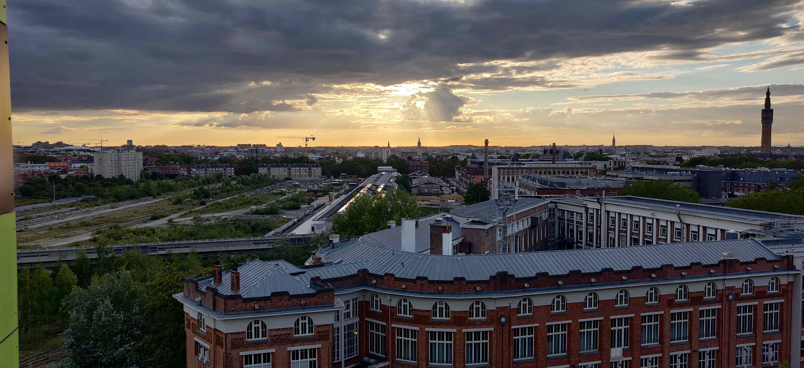

Salut à toi, mon ami·e. Ça fait un bout de temps, n'est-ce pas ? Il s'en est passé des choses depuis octobre. Tout le monde s'accorde à dire que cet automne vient clôturer une année bien morose, qui nous aura plus que jamais montré à quel point le contact humain est primordial. Heureusement, nous vivons dans une époque où la connexion n'a jamais été aussi facile, nous permettant de garder contact avec nos _potos_ et êtres chers par le biais d'une messagerie instantanée lambda.

C'est par contre légitime de nous interroger sur l'influence du smartphone, l'intermédiaire, sur notre comportement. Le documentaire _Netflix_ (promis, je n'ai pas d'action chez eux) [The Social Dilemma](https://www.thesocialdilemma.com/) nous sensibilise d'ailleurs au sujet. Au-delà de la capacité de nos appareils fétiches à nous détourner de nos intentions initiales pour presque nous suggérer ce que l'on devrait faire à la place, les plateformes en ligne sont des mines inépuisables d'information. Mais à quel prix ?

## Le mirage d'un eldorado au bout des doigts

L'abondance et l'accessiblité quasi-immédiate aux informations a un côté grisant : peu importe ce que l'on cherche, la réponse est au bout de nos doigts. La complexité des systèmes de référencement et des algorithmes de recherche relève clairement du génie. La face plus sombre de la pièce (il y en a toujours une, hélas) se dessine quand c'est l'information qui vient à nous : un [fil d'actualité](https://www.nouvelobs.com/rue89/notre-epoque/20171222.OBS9715/shot-de-dopamine-ce-que-facebook-fait-au-cerveau-de-mon-amie-emilie.html) rempli de posts, le portail d'une plateforme de streaming ou une notification. Instinctivement, on a plutôt envie de se laisser tenter. Et c'est bien normal. Quel mal y aurait-il à ce que l'on nous propose du contenu ? Qui se ferme totalement la porte à la découverte ? D'autant plus qu'en termes de suggestions, là aussi, les algorithmes ont atteint un niveau de sophistication assez incroyable.

Malheureusement, recevoir des tonnes de contenu, parfois personnalisé, ne nous renseigne en rien sur sa qualité. Par qualité, j'entends une information ou un média qui nous apporte vraiment une plus-value par rapport à notre but initial. C'est donc très subjectif, et rien ne t'empêche de considérer une vidéo divertissante comme de qualité si ton but était justement de te divertir. En revanche n'as-tu jamais ouvert ton profil Facebook ou Instagram pour voir tes notifications, et finalement te perdre dans un dédale de contenu sur ton fil d'actualité ? La quantité de contenu personnalisé, qui a grandi au même rythme que les espaces de stockage et la rapidité d'accès se sont développés, a quelque chose d'un _eldorado_ inépuisable; le moindre instant passé en-dehors de celui-ci nous donne l'impression de _rater quelque chose_. De plus en plus de personnes s'intéressent d'ailleurs à [ce phénomène](https://fr.wikipedia.org/wiki/Syndrome_FOMO).

Être conscient de ce mirage bouscule notre conception du Web : le volume de contenu potentiellement intéressant se dégonfle comme un ballon. En faisant ce tri, on se libère d'un énorme fardeau. Il n'y a aucune honte à ne pas savoir, surtout quand l'information en question ne nous apporte rien. Notre obstination à vouloir être au courant de tout ne date pas d'hier. C'est un comportement essentiellement social, basé sur la peur que notre propre ignorance sur divers sujets nous exclue du groupe. La question que je me pose alors est la suivante : est-ce pour notre petit ego ou dans leur intérêt que l'on informe nos amis du dernier fait divers en Meurthe et Moselle ? Est-ce constructif, ou cherchons-nous à diriger artificiellement l'intérêt des autres sur nous ?

## Tout savoir et savoir faire : un arbitrage difficile

Accumuler des informations prend tout son sens lorsqu'on les fructifie dans un objectif : parfaire ses connaissances sur la dynastie des Ming, être au courant des grands enjeux de notre époque, ou simplement rire un bon coup. Vouloir entreposer des choses pour pouvoir en faire l'étalage fait écho à une autre grande illusion à laquelle nous sommes tou·te·s exposé·e·s; celle que le simple fait de posséder, que ce soit matériel ou intellectuel, [suffira à remplir notre être](https://www.babelio.com/livres/Piketty-Capital-et-ideologie/1167551). Et comme tu peux t'en douter, cette vision est réductrice. L'information et la connaissance n'a de valeur pour nous que si on la met en regard avec nos projets, nos valeurs et nos opinions. Ça suppose d'être perméable à cette information : combien de conversations se terminent au moment où la personne énonce le fait ? Alors c'est rassurant, tout le monde tombe d'accord et se conforte dans ses opinions mais le débat n'avance pas. Quel est l'intérêt de répliquer naïvement l'information sans l'interpréter ?

Libre à toi, d'ailleurs, de ne pas t'intéresser à une information. Tu peux ne pas te sentir concerné·e. L'action concrète a parfois plus de valeur, pourvu que tu connaisses ta direction. C'est justement en acceptant notre incapacité à tout savoir que l'on élimine tout ce qui relève de la reproduction sociale, et que l'on se concentre sur ce qui compte vraiment. Il existe une infinité de trajectoires et certains savoir-faire uniques demandent [des années](https://www.vivrelejapon.com/a-savoir/comprendre-le-japon/metier-chef-cuisiner-sushi) avant d'être véritablement maîtrisés. On ne devient pas soi-même en 2 semaines, n'en déplaise aux best sellers de développement personnel. À vouloir devenir omniscient, on étale la confiture sur une tartine qui ne cesse de grandir.

## Un esprit vivant et disponible auprès des autres

Chaque information ou sollicitation superflue que l'on supprime libère de l'espace dans notre vase, prêt à accueillir d'autres fluides. Le vide occasionné peut sembler vertigineux, mais je crois qu'il nous rend davantage sensible aux opportunités qui s'offrent à nous au quotidien. Réfléchissons donc à [ce que l'on met dans ce vase](https://usbeketrica.com/fr/article/vivre-sans-objets-qui-sont-les-minimalistes), car sa capacité est limitée. On peut l'augmenter en travaillant notre faculté à être disponible comme on le ferait avec un muscle, mais pas indéfiniment.

Quelle quantité de travail ? Quelle quantité d'écoute, d'aide ? Quelle quantité de bons moments et d'amour ? Avoir toujours un petit peu de vide dans ce vase a un effet non négligeable sur nos facultés de flexibilité et de spontanéité.

Un esprit disponible et sans calcul sera toujours plus épanoui que son antipode distant et fermé au changement. La disponibilité nous permet aussi de prendre du recul sur ce qu'il nous arrive et de rectifier le tir si besoin. On est de surcroît en mesure de plaisanter, de s'amuser et de rire quand l'occasion se présente. Apprécier les moments simples comme ils viennent fait aussi partie de la vie. Est-ce qu'on a vraiment besoin de se préoccuper d'autre chose lorsqu'on est assis en terrasse avec des amis autour d'une petite bière ? Si c'est le cas, c'est sûrement que l'on n'a rien à faire ici.

Penses-y la prochaine fois que tu te reprocheras, ou que quelqu'un te reprochera de ne pas être au courant. Culpabiliser n'est justifié que si tu penses, à l'instant _t_, que cette lacune te pénalise dans ta quête. Et sinon, il y a de grandes chances que ce soit une énième babiole destinée à prendre la poussière sur une étagère.
