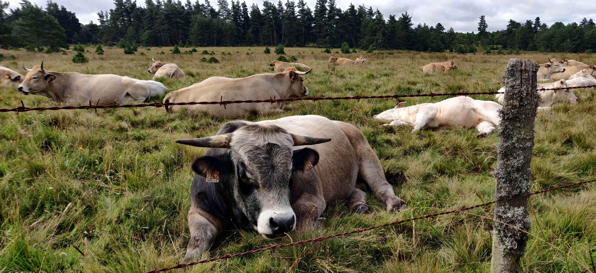
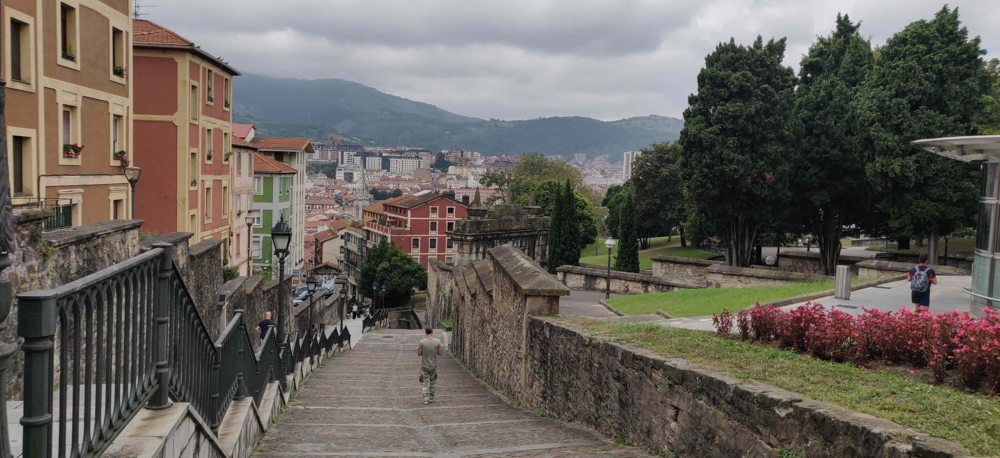
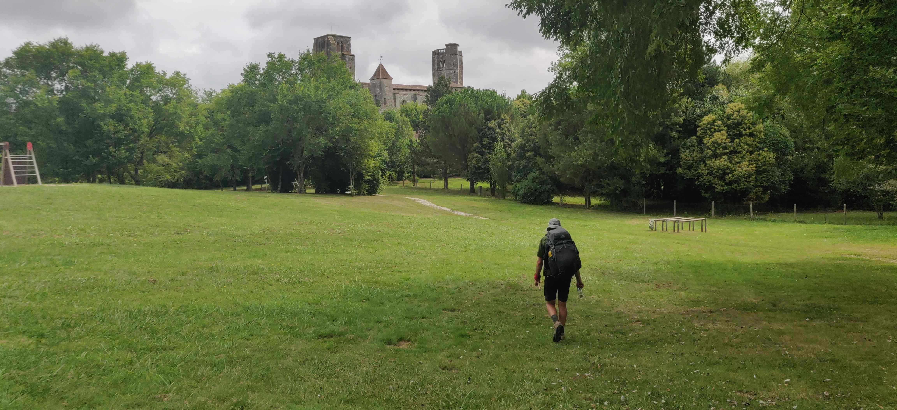
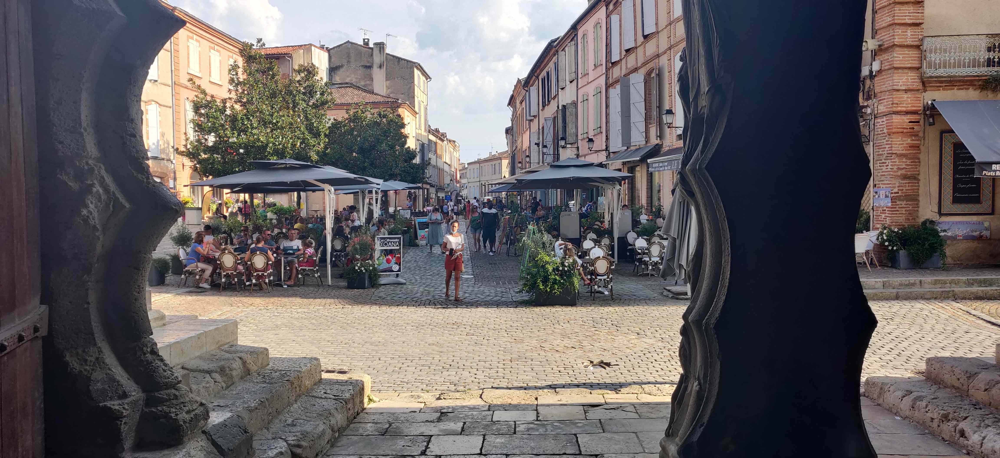
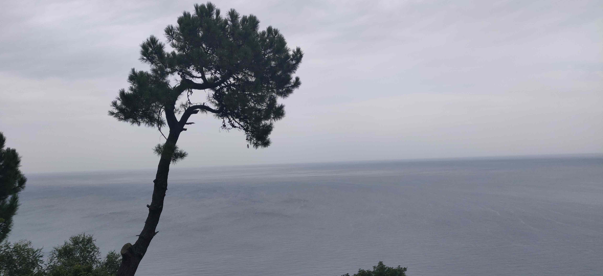
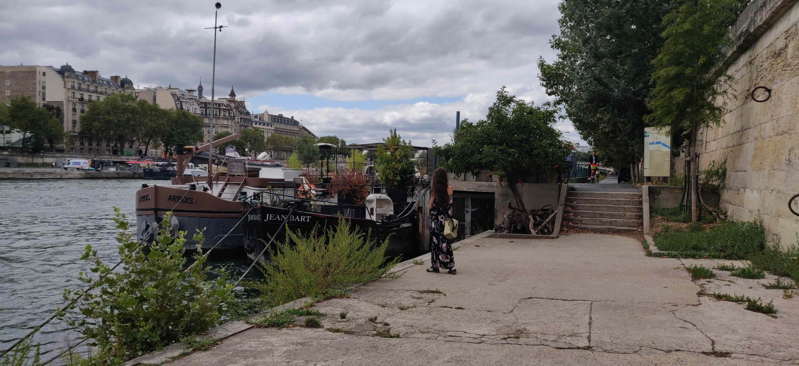

Plier le monde à son goût. Arrondir les angles. Tirer les ficelles. Suivre un soit-disant mode d'emploi du bonheur, nous le faisons tous. Pas plus tard que ce matin, et comme tous les matins, je voulais un café. J'aurais tué, remué ciel et terre pour ce café.

Que se serait-il passé si je ne l'avais pas eu, ce café ? Si je n'étais pas ce jour-là à Paris et ses centaines de Starbucks, Brioche Dorée et consorts ? J'aurais été de mauvaise humeur ou bien, au moins, perturbé. Je l'ai donc pris ce café, et je suis en proie à ce besoin matinal, inflexible, non négociable, véritable béquille routinière.

Pourquoi ce désir si prononcé, accessoire en apparence, a-t-il autant d'emprise sur moi ? Pourquoi s'est-il imposé comme une dépendance, ma priorité numéro un au réveil ? Dois-je m'en séparer ? Est-ce bien ? Est-ce mal ?

Ce n'est pas à cette question que je répondrai aujourd'hui. Elle servira simplement à nous amener vers un sujet plus global, à savoir la couveuse sous laquelle notre société de consommation nous maintient et les répercussions sur nos interactions sociales. Comme toujours il s'agit d'une ébauche sans source autre que mon propre esprit, simple dissertation visant à te questionner, toi jeune lecteur.

Revenons à notre sujet. Factuellement, le café est un plaisir de riche. Un luxe qui s'est démocratisé. C'est une denrée énergivore, importée d'autres continents, produite en quantités astronomiques avec des stratégies qui déportent le vrai prix vers les ouvriers du bas de la chaîne et sur l'environnement. Le café est bourré d'intermédiaires, carbonisé pour sa conservation plusieurs semaines dans des entrepôts puis dans nos placards. Tout ça pour que nous puissions, presque à chaque instant de la journée, remplir notre tasse d'un liquide noir qui, on l'espère, nous donnera le fameux coup de fouet tant espéré.

Étonnamment, c'est l'omerta à ce sujet. Même dans les entreprises les plus vertueuses sur le papier, on ne plaisante pas avec le café. À croire que des milliards de personnes sont dans le même état de dépendance que le mien. Que cette substance, au moins pour une partie de nous, fait partie des conditions initiales pour être en capacité de vaquer correctement à nos occupations quotidiennes. Un business complexe destiné à ce que l'on puisse sortir du lit avec une vivacité d'esprit que nos heures de sommeil ou, au moins, de repos, de paix intérieure ne nous procurent pas en quantité suffisante.

## L'ère du tout cuit

Je suis mal à l'aise avec la façon dont notre économie nous conforte dans une posture d'enfant gâté. À quel point elle nous abstrait des coûts réels de nos convoitises et à quel point, au bout du compte, elle nous rend captifs.

Là où nos ancêtres devaient faire face à la réalité, la cruauté, les aléas de la nature, nous sommes accoutumés à ce que tout soit pré-mâché à l'image de nos steaks. On nous sert tout dans de jolis emballages, si possible à domicile.

Peu nous importe si les conditions de travail du chauffer Uber sont bonnes puisqu'au final, on ne le connaît pas vraiment. Prêt à manger, à porter, à habiter. Pourvu qu'on ait les moyens, tout est à notre portée en à peine un claquement de doigts.

Accoutumés à ce mode de vie du _pré-à peu près tout_, deux conséquences s'entrechoquent et se renforcent mutuellement. D'un côté, en ne prenant aucun recul sur cette attitude consommatrice on devient des coquilles vides, superficielles, sans nourriture véritable pour notre esprit qui ferait qu'on se sente appartenir à quelque chose de transcendant; de l'autre on calque nos caprices, notre aversion à la difficulté sur nos relations sociales que l'on voudrait totalement prévisibles.

J'ai l'impression qu'on voudrait que notre vie s'apparente à une grande pièce de théâtre, autrement dit que, quand on s'adresse à quelqu'un, on sache déjà exactement la réplique qui va suivre. Que toutes les réactions de notre entourage soient explicables par _A + B_. Puisqu'on croit connaître le plan à suivre pour être heureux on planifie, on agence le monde à notre sauce pour que tout marche comme sur des roulettes sans prendre le temps de revoir la feuille de route.

Quelle indigestion de concevoir que, du jour au lendemain, quelqu'un puisse s'énerver contre nous sans que l'on comprenne pourquoi, ou que nos proches ne répondent pas totalement à nos attentes. Quel malaise que d'envisager que l'on on puisse nous tourner le dos, temporairement ou définitivement.

Quand on voit à quel point un simple retard de cinq minutes peut vexer, on comprend que la perspective d'un abandon, d'une friction ou d'un simple dispute nous effraie, moi le premier.

## Nous défaire du contrôle et nous réconcilier avec l'inattendu

Quand on creuse au fond de nous-mêmes, qu'on s'écoute, qu'on se découvre en pensant pourtant se connaître, on modifie nos comportements et nous sommes, de facto, amenés à surprendre nos proches. À décevoir, à être maladroit. À faire des erreurs. C'est une conséquence inévitable de la spontanéité, imparfaite par essence. Aimerait-on pour autant qu'on nous condamne à perpétuité à chaque manquement ? Et puis qu'est-ce qu'un manquement, au juste, sinon un signe que l'on ajuste le curseur ? Dans une certaine mesure, évidemment, une tarte à ta voisine ne sera jamais très bien accueillie.

À quoi serions-nous destinés si l'on faisait tout pour ne jamais froisser, pour ne jamais vexer, en prenant d'énormes pincettes à chaque échange ? Hélas, même en prétendant cerner une personne sur la base de son comportement, on interprète des signaux envoyés par un être qui, lui-même, n'est pas au clair sur ce qu'il laisse transparaître. À quoi bon, dans ce cas, rester figé dans le contrôle ? Que risque-t-on, au juste, à contrarier ?

Personne n'aime le conflit. Pourtant, la confrontation est un terreau fertile à l'élargissement du champ des possibles et au développement de l'empathie. Là où la prévisibilité s'arrête commence la remise en question. Alors que choisir entre contrôle total et tolérance à la surprise, à l'imprévu ?

J'ai la conviction profonde que l'on gagne toujours à multiplier les confrontations de points de vue, parfois contradictoires. Qu'en restant sous couveuse, dans un micro-climat étriqué où l'opinion et l'expérience uniques règnent, on appauvrit son périmètre bien qu'on réduise le danger. Sans relief, impossible de mettre les choses en perspective.

Admettre le caractère perpétuellement changeant des choses et des personnes nous permet de comprendre qu'un proche ne nous donne pas toujours entière satisfaction, notamment que cet ami ou être aimé

- ne nous donne pas de nouvelles sur commande avec un délai de livraison raisonnable;
- ne soit pas livrée dans un bel emballage de compliments et de paroles qui nous confortent;
- n'ait pas de mode d'emploi;
- sorte parfois de son mode de fonctionnement habituel pour s'emporter à cause d'un malêtre passager, et malgré tout le lui pardonner. Ou, encore mieux, l'aimer davantage précisément pour cela.

## De pantin à électron libre

Notre système s'efforce de dompter un monde gouverné par l'aléa avec une orchestration si savante qu'il nourrit l'illusion que notre environnement est et restera à tout jamais prévisible. C'est pourtant le détachement, l'absence de contrôle qui, je crois, nous fait grandir en tant que personne bel et bien vivante.

Quand on veut plaire et donc, en quelque sorte montrer aux autres qu'ils ont des raisons d'être en notre compagnie, il est tentant de basculer dans le consensus. Ce comportement est l'extrême opposé de l'obsession de vouloir tout contrôler, détaillée précédemment : on inverse les rôles en laissant la personne devenir marionnettiste à son insu.

Pour entrevoir une porte de sortie, démagnétisons l'aimant qui dirige à tort la moindre parole vers ce que nous sommes au plus profond de nous. Réalisons que les actions qui nous déçoivent sont liées à un vécu, encore une fois tout aussi imparfait que le nôtre. Nos semblables sont nettement plus proches des électrons libres que des pantins.

Qui, à vrai dire, a envie d'être un pantin ? Qui s'inspire d'une personne prévisible au moindre millimètre comme un chien bien dressé ? Et si c'est le cas (car on peut se sentir en sécurité dans ce type d'interaction), se rend-on vraiment service sur le long terme ? Est-ce qu'on se sent, au final, plus épanoui ? Se croit-on soi-même capable d'inspirer, de témoigner d'un vécu autre que celui d'avoir suivi les vents hasardeux qui se sont présentés à nous ? D'avoir construit quelque chose de nos propres mains ?

Paradoxalement, c'est quand on se désolidarise que l'on fédère le plus. Le lâcher prise, autant en termes de contrôle que dans notre propre manière de réagir aux sollicitations extérieures est pour moi une condition _sine qua non_ à la construction d'une vie sereine.

Plus qu'un repli sur soi, nuancer l'attention que l'on porte au regard des autres en accordant la même importance à notre propre regard sur nous-mêmes me paraît indispensable pour être en mesure de partager un vécu, une aide, un conseil significatif, désintéressé et sincère à quelqu'un.

J'en viens même à penser que le détachement est une posture moins égoïste que celle de ne pas admettre que l'autre puisse exister et évoluer indépendamment de nous, sans pour autant détériorer la relation. Croire en l'indépendance totale et assumée est bien-sûr utopique au vu de nos besoins affectifs mutuels, mais comme souvent c'est le juste équilibre qu'il semble le plus viable d'adopter.

Marionnettistes ou pantins, tâchons de nous rapprocher des électrons libres. Un idéal n'est pas censé être réaliste. Il permet de repousser les limites au-delà de ce qui semblait auparavant inconcevable. Comme quoi, les rêves de gosse ne sont pas tous à jeter...
