## Checkpoint

Nous y sommes. Avec une bonne crève mais heureux, je crois. Heureux de me sentir de plus en plus libre. Oui, je ne me sens pas lié à cette condition-ci. Actuelle, matérielle, physique. Plus libre aussi parce que conscient de mes limites et mes failles. On est tous humains et comme tout humain, j'ai mes blessures. J'ai beau me dire que je ne devrais pas avoir de névroses, elles existent. Je pense à un nouveau départ dans ma vie et en même temps, je suis retenu par tout un tas de choses qui touchent à des blessures. Mais aussi à mon cœur. À ce que je suis au fond de moi. Et heureusement. C'est mon humanité qui s'exprime.

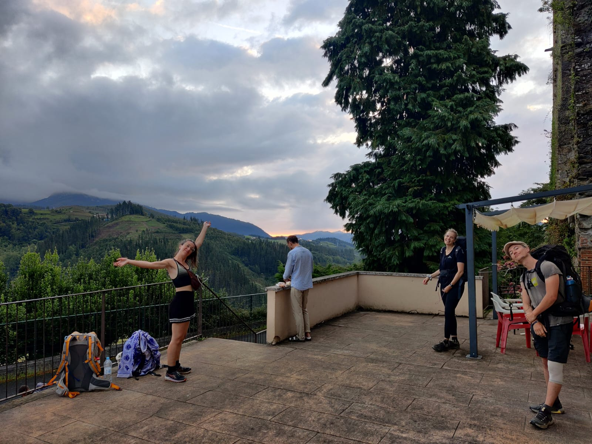

Je pense à partir de Lille. À changer de métier. En même temps, j'accepte d'être attaché à ce cadre. Une rencontre à laquelle je tiens alors que l'on ne s'est absolument rien promis l'un l'autre. Des amis. Une situation financière sécurisante. Un appartement cosy. La vie citadine piétonne avec tout à proximité. Un quartier agréable. Je prends le temps d'apprécier, jusqu'à ce que le choc frontal soit trop évident pour poursuivre dans cette direction.

Je ne m'en veux pas de me laisser ce temps. J'accepte d'être un peu moins dans l'action. De m'accorder, des fois, des shots de dopamine. Peut-être un peu trop, c'est vrai. J'ai besoin de réaliser dans ma chair que le plaisir débridé mène à un malêtre profond. De sentir un retour à l'équilibre, fondé sur des bases plus saines bien que toujours précaires. Glaner de l'affection à court terme en fait partie, mais je l'accepte. C'est comme ça pour l'instant. Je chemine à mon rythme.

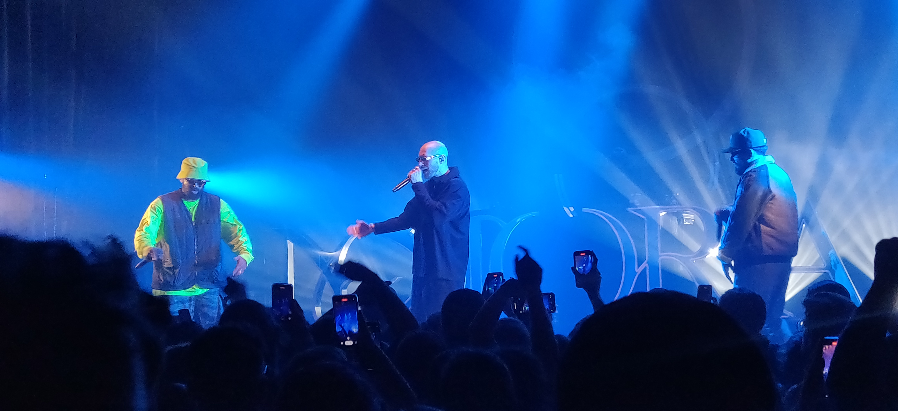

Ce qui fait que je garde le cap, c'est ce feu toujours quelque part près du cœur. Même si aucune action ne paraît aller de manière retentissante dans la direction de mes rêves, je m'y attelle en silence. Je réalise des choses qui mèneront probablement à des actions plus concrètes au cours de cette année, ou la suivante. Ou encore la suivante. Mes valeurs se consolident. J'ai de plus en plus conscience de mes forces. J'apprends aussi à exploiter mes failles pour créer du beau et de la singularité. Parfois même remettre en question le fait que ce sont des failles.

> Vous réalisez aussi que toutes les choses vraiment importantes, la beauté, l'amour, la créativité, la joie, la paix, trouvent leur source au-delà du mental. Et vous commencerez alors à vous éveiller. \[1\]

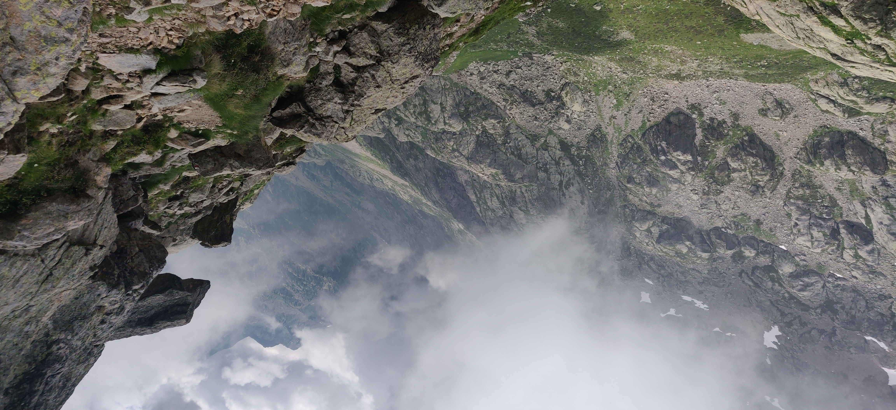

## Le mental infernal

Cette année a été celle de trop, en termes de pensées handicapantes et avilissantes. Pensant avoir affaire à un allié, j'ai découvert un mental plutôt proche du bourreau. Un coach impitoyable. Je mobilise d'ailleurs cette image pour l'éteindre à petit feu.

On peut être exigeant⋅e envers soi-même. Le problème, c'est quand on se tyrannise. Pousser les
limites, avoir une certaine discipline, je reste convaincu que c'est bénéfique pour avancer. Je n'aurais sûrement pas vécu certaines choses si je ne m'étais pas, à un moment donné, surpassé. Ceci dit, je garde en tête que le dépassement de soi est une dette envers nos réserves physiques et psychologiques. Comme toute dette, creuser le découvert peut s'avérer dangereux. Jusqu'à présent, et encore un peu maintenant, je vivais dans une sorte de découvert permanent. Toujours à la frontière de mes limites physiques et psychiques, sous l'injonction d'un mental qui m'incitait à remettre une pièce dans la machine pour conserver un semblant d'estime.

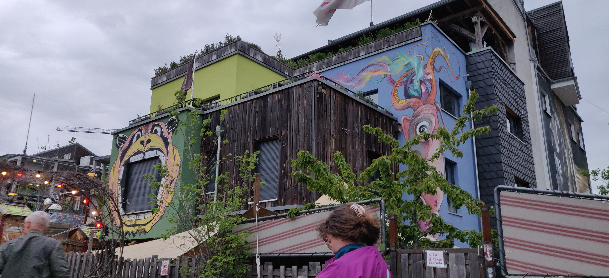

Voir tout renoncement, tout repos comme une baisse de ma valeur intrinsèque est ce qui rend ce *coach interne* si impitoyable. J'ai encore de la difficulté à percevoir cette attitude comme autre chose que de la paresse. Un sentiment de passer à côté de ma vie, de ne pas l'avoir vécue pleinement, ne pas avoir tout tenté. En guise de réponse, 2023 m'a montré que toujours être dans la posture inverse, se dépasser perpétuellement sans relâche, mène à vivre moins pleinement sa vie. Comme étourdi, assommé, hébété. Et aussi bien épuisé. J'essaie d'entretenir cette pensée que la surenchère, le *toujours plus d'efforts* est un manque de respect envers soi.

> Notre obsession de la perfection nous amène à exercer à l'égard de nous-mêmes un harcèlement moral qui tomberait sur le coup de la loi si nous l'appliquions à l'encontre d'un tiers ! \[2\]

Ça peut paraître sévère. Parler de torture, de non-respect, de violence, ce n'est pas anodin. Mais je le pense vraiment. En constatant les séquelles que cette attitude a et a eu sur mon corps et ma tête, je me suis rendu à l'évidence.

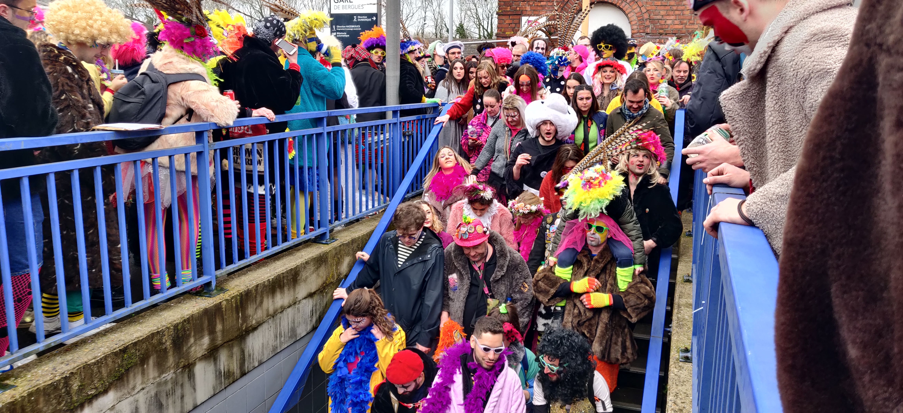

## Préférer l'activité à l'agitation

Maintenant, que fait-on ? Comment continue-t-on à avancer vers ses rêves, son étincelle, tout faisant preuve de respect envers soi ?

J'essaie de me faire confiance. La principale vertu que j'ai trouvée dans le ménagement est la clarté d'esprit vis-à-vis de mes aspirations, mes valeurs. Quand je garde un peu d'espace pour ressentir, laisser libre court aux pensées non sollicitées, je me rapproche de ma vérité intérieure. Je confronte le monde extérieur à mes valeurs intrinsèques. Paradoxalement, c'est dans les périodes de l'année où je me suis le plus activé que je me suis senti le plus perdu.

> Être actif, ce n'est pas s'agiter. Ce n'est pas courir vainement dans tous les sens pour donner (et se donner) l'impression d'être dans le faire, mais c'est construire en profondeur, sur le roc et non sur le sable. C'est comprendre, c'est trouver une solution nouvelle à une situation qui semble sans issue. Je suis souvent passif quand je m'agite. Je suis réellement actif quand j'ose tout arrêter, attendre, faire confiance. Le médecin doit prendre le risque de rester un instant sans savoir ce qui se passe. Nous aussi. C'est à cette condition que, peut-être, quelque chose de complètement autre, auquel je n'avais pas pensé, va m'apparaître comme une évidence et me sortir de l'impasse dans laquelle je me suis enlisé. \[2\]

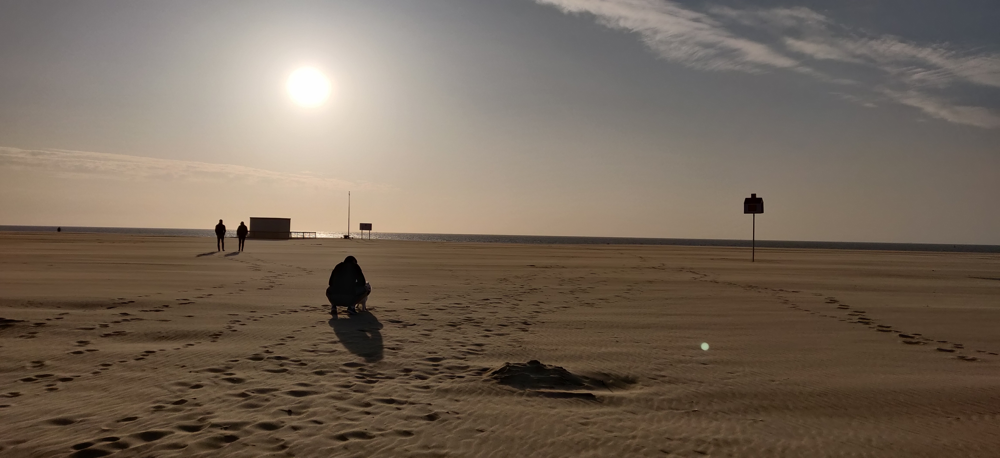

J'aime alterner entre des périodes de forte activité et d'autres plus contemplatives. Tout "charbonnage" est un moyen d'arriver vers un but. Cette année, j'ai parfois oublié la partie contemplative au point d'en perdre de vue l'objectif initial, ce vers quoi j'avais envie d'aller.

Comment ça s'est ressenti ?

Dans le professionnel, par une perte de plaisir au travail. Ce qui m'anime dans mon métier, c'est l'aspect "artisanal", s'améliorer en permanence dans la pratique du développement logiciel. On travaille avec une matière première, le code. Dans un langage. On peut toujours changer sa manière de penser pour écrire du code plus lisible par nos collègues, et répondant mieux au besoin de l'utilisateur.

J'ai mis cet aspect de mon métier en arrière-plan à plusieurs reprises cette année. Pourquoi ? Les attentes de l'entreprise et de mes collègues, et surtout la perception que je me faisais de leur estime de moi ont pris une place trop importante. Aveuglé par le regard des autres, j'ai mis de coté ce "plaisir" du métier de
développeur.

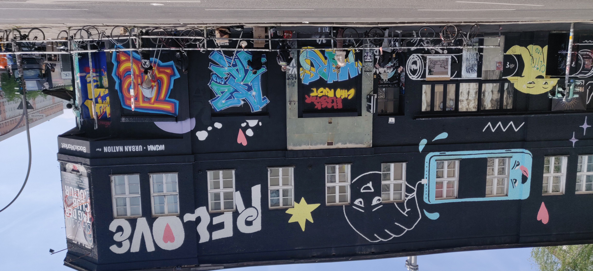

À l'avenir, je me fais la promesse de garder en vue cette flamme. Je suis en paix avec le fait que garder cette flamme peut déplaire à certaines personnes ou répondre moins exactement aux attentes d'une entreprise. J'ai plu à tout le monde au prix de ma vitalité, qui m'a amené à faire ce métier. La perdre c'est, d'une, perdre l'envie de se lever le matin. Ce qui est encore plus dommageable pour l'entreprise économiquement. De deux, c'est rogner sur son enthousiasme. Voir tout en noir et blanc, même au-delà des portes de l'entreprise. S'oublier peut vite devenir synonyme d'aliénation, de *zombification*, de *fantomisation* ou tout mot que tu sauras toi-même inventer.

## L'urgence d'une purge

Certaines graines ont simplement continué de grandir en 2023. La pensée, déjà entretenue depuis quelques temps, de me dire qu'un jour je ferai peut-être un autre métier me donne une grande confiance. Je me sens de plus en plus prêt à changer. Par humilité, j'ai envie de me laisser la possibilité d'exister d'une autre manière dans cette société que celle-ci. Quitte à expérimenter pour ensuite revenir dans le même job. Je n'ai essayé qu'un domaine, après tout.

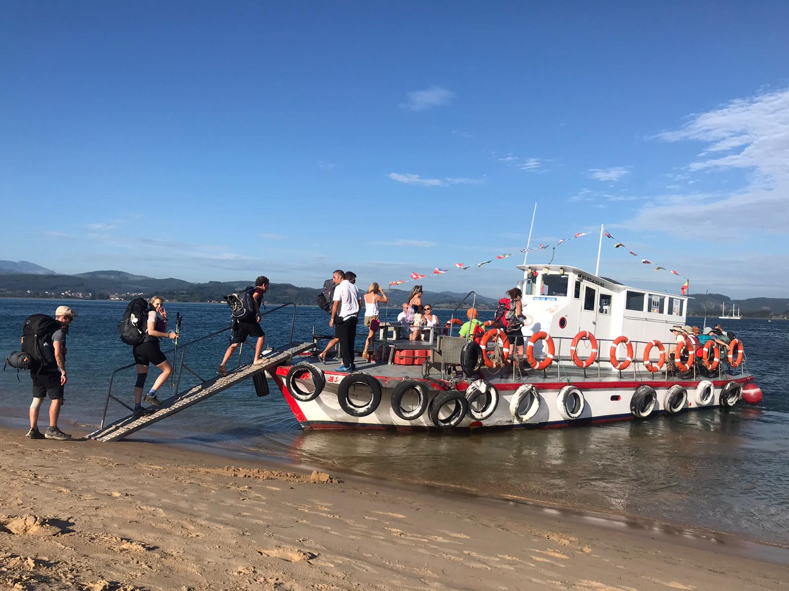

Je suis en paix avec le fait de faire un break. De ne plus cadencer les journées par l'horloge de l'emploi de bureau, au moins pendant quelques temps. Prendre le temps de prendre le temps. Faire autre chose. Voyager. Un nouveau départ. C'est ce qui crie le plus fort, en moi, en ce début d'année.

Je ressens ce besoin de purge de l'esprit, de réduire les routines pour retrouver ce qui, au fond du fond, importe vraiment. Un décrassage. Je sens que ma situation professionnelle est de moins en moins alignée avec ce qui, en moi, m'anime et ce que je peux apporter à ce monde. Qu'elle a pour l'instant été dictée par l'aspect "ce en
quoi je suis doué" de l'[Ikigaï](https://lesnouveauxtravailleurs.fr/comment-trouver-son-ikigai-ma-methode-en-4-etapes/) et pas suffisamment par le reste.

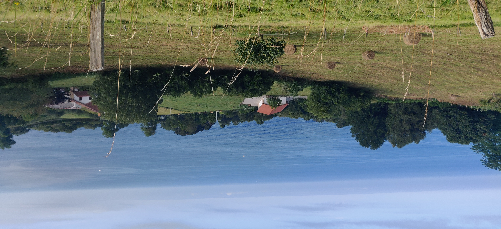

Je pense à couper, sans forcément de projet particulier à la clé. Juste faire un break de la *machine à laver* travail. Me permettre de taper dans les économies quelques temps, mais investir dans quelque chose de bien plus important qu'une épargne. Quelque chose que je garderai, pour le coup, pour le reste de mon existence.

J'ai été marqué par une phrase de conclusion d'un hôte d'*Albergue* sur le *Camino del Norte* cet été. Parti explorer plusieurs pays pendant des années avec son 4x4, il nous a présenté, à nous pèlerins, son aventure en terminant par

> Hay cosas que no se enseñan en las mejores universidades del mundo. Caminando, fui un alumno en la escuela de la vida.

Ça m'a fait peur, cette idée que ma place n'était pas forcément ici. D'abandonner beaucoup de choses. Mais en fait, elle n'est nulle part indéfiniment pour personne, cette place. Tout est périssable.

Bon, j'ai toujours peur, on ne va pas se mentir.

Peur de franchir le pas et d'affronter tous les bouleversements potentiels. Peur de me sentir très seul.

Peur de voir s'en aller ce pour quoi j'ai étudié d'arrache-pied pendant cinq ans, un job d'ingénieur logiciel. Parce que je me suis construit là-dessus. Et, a fortiori, j'existe en grande partie à travers cette dimension de moi-même. Mais je crois que je suis de en paix avec le fait de l'abandonner quelques temps, peut-être pour toujours s'il le faut.

Peur de vivre sur mes économies. Quitter une situation financière confortable. Peur du regard des autres, qui sécurisent leurs finances.

Peur de parler de ce que je ressens au fond de moi. Peur de bégayer, de ne pas paraître assez décidé. Peur que l'on me fasse douter.

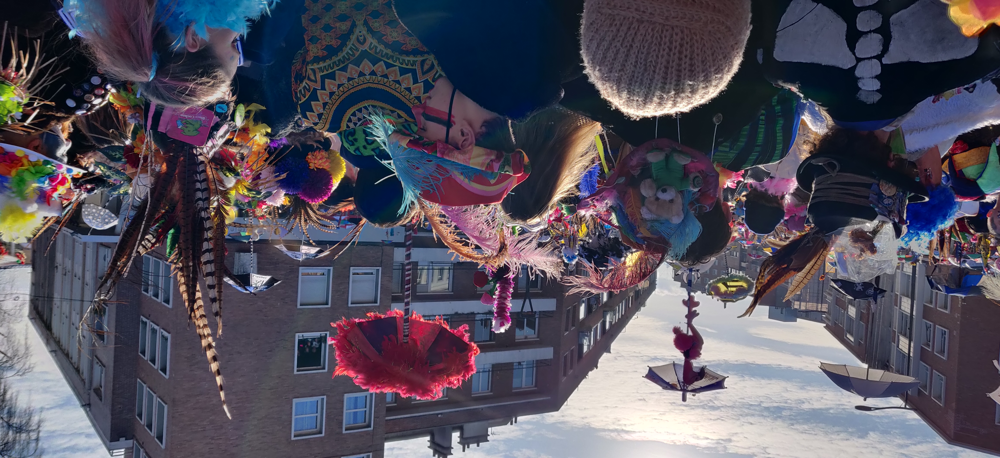

Alors je garde certains rêves pour moi. Je préfère attendre d'en faire naître quelques-uns plutôt que de les voir s'éteindre avant même d'avoir eu l'occasion de germer.

## Laisser partir le scientifique forcené

Je réalise de plus en plus l'importance du [cerveau droit](https://www.futura-sciences.com/sante/questions-reponses/cerveau-cerveau-droit-cerveau-gauche-differences-10506/), sans jeter à la poubelle ce que le gauche m'apporte et m'a apporté. De temps en temps, j'apprécie la satisfaction de me dédier corps et âme à résoudre un problème complexe. La mentalité guerrière à ne rien lâcher m'a aussi rendu service. J'ai confiance en le fait de pouvoir remobiliser ces facultés quand ce sera nécessaire.

Depuis quelques années et encore plus celle-ci, je ressens un autre élan que celui du cerveau gauche. Un élan d'expériences dans lesquelles j'explore d'autres aspects de mon humanité. Le constat des belles expériences qui en ont découlé en lâchant prise, en riant, chantant, marchant m'aide à y faire confiance. Comme une vague idée, quelque chose qui prend aux tripes en nous disant ["ça, c'est juste"](https://podcast.chloebloom.com/episodes/suivre-son-etincelle-malgre-tout-comment-rester-a-l-ecoute-de-son-coeur). Suivre ces intuitions et en récolter les fruits, comme cet été sur le *Camino del Norte*. Puis, à tout prix, suivre ce "ça, c'est juste".

J'apprends aussi à exister plus sereinement avec les personnes qui me sont chères. Juste être là, et avoir confiance en ce que je leur apporte. Ne pas me plier en quatre. Juste être là. Être avec eux, et avec moi-même en même temps.

Me rapprocher des personnes qui manifestent l'envie de partager ces moments. Me tenir à distance des états d'esprit trop loin de mes idéaux, en ayant bien conscience que les leurs ont la même valeur que les miens. Évidemment. Je garde les propos qui me font hérisser les poils dans une sphère périphérique de ma vie. Ce ne seront peut-être plus les mêmes qui auront cet effet, au fil du temps.

Me laisser transporter par la musique. Pourquoi pas en faire quelque chose. Écrire, comme je suis en train de le faire. Jouer de la guitare. Intégrer un groupe de musique ? Rester curieux. Expérimenter d'autres manières de penser pour être plus libre. Partager un repas, un film, une balade, une conversation ou juste des silences avec des humains. Rire. Beaucoup. Essayer les psychédéliques. Faire des blagues de papa cinquantenaire. Partir en voyage, lentement, avec un sac à dos. Garder le strict nécessaire. Parler des langues étrangères. Oser dire à cette fille, là-bas, qu'elle est belle. Que je l'aime, en laissant quelques secondes l'incertitude quant au fait que l'on se revoie. Dire à mes proches aussi, que je les aime. Le leur montrer par tout ce qui n'est pas matériel. Être reconnaissant pour toutes les choses que j'ai déjà, là, ici. Chanter. Beaucoup. Pourquoi pas en faire quelque chose. Éprouver des émotions fortes, celles qui me font sentir appartenir à quelque chose de beaucoup plus grand que mon enveloppe corporelle. M'absorber dans l'histoire d'un⋅e ami⋅e. Lui apporter juste une oreille attentive. Être reconnaissant qu'i⋅elle me fasse confiance. Dessiner, peut-être. Continuer à courir, à cultiver cette détermination qui fait que je me tiens au sport depuis maintenant presque 10 ans sans interruption. Comprendre pourquoi je pleure si peu. Guérir des cycles dépressifs qui reviennent depuis mes vingt ans. Trouver l'amour.

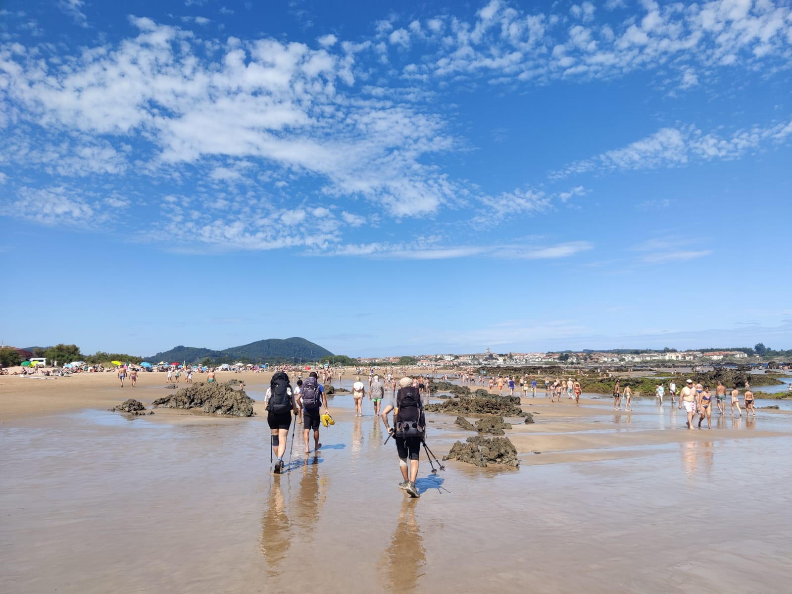

## Célébrer, un petit peu

Cette année a aussi été le théâtre de belles réalisations. Des instants, seul, de plénitude. L'impression d'être au bon endroit. De faire la seule et unique chose intérieurement juste sur le moment. Un sourire qui se dessine naturellement sur mon visage. Un air musical qui me transporte.

Beaucoup moins hésiter. Retrouver des sensations de bien-être perdues depuis la fin de l'adolescence. Les soirées de fête où l'on ne pense pas au lendemain. Et pourtant, ne pas avoir l'impression de rater ma vie. Bien au contraire. Ne pas me dire qu'un [miracle morning](https://miraclemorning.com/) aurait été plus raisonnable.

Justement, arrêter d'être raisonnable. Taquiner les limites pour mieux m'équilibrer. Manger trop de sucre, trop de sel. Trop picoler. Et constater qu'au final mon corps, mon esprit reviennent à un état pérenne, un rythme de croisière. Accepter que, des fois, on a besoin d'un craquage.

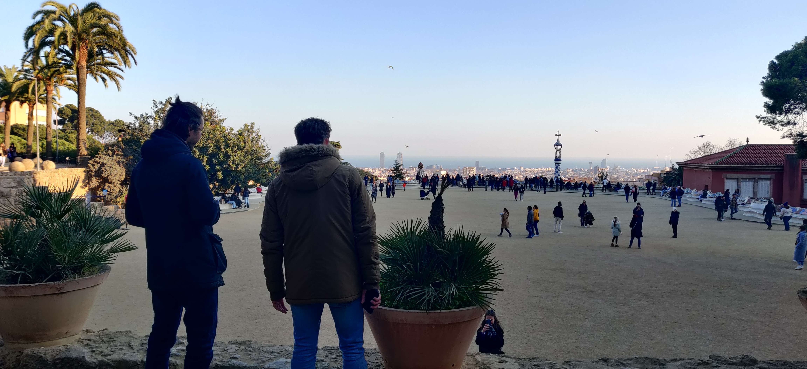

Me sentir entouré même seul. Avoir cette vision incroyablement libératrice que, même sans interaction, mes proches sont là. Ils sont avec moi. Tout le temps. L'éloignement physique est beaucoup moins pesant qu'avant. C'est comme si le fait d'avoir vécu des événements marquants avec ces personnes nous liait d'une glue si forte qu'elle défie les lois de la physique. La glue des souvenirs.

C'est bien ce qui compte, au final. Créer des souvenirs. Bons et mauvais. Ce mantra, je l'ai en moi depuis quelques années maintenant. Je le garde précieusement. Quels qu'ils soient, les moments partagés sont la matière première qui me permet aujourd'hui d'écrire ces lignes. En ermite, sans interaction, sans sollicitation, sans partage d'émotions, de projets, de moments, je suis muet. C'est ce contact avec l'autre et la nature qui, plus qu'agrémenter, est le carburant de mon existence. C'est de là que je puise toute ma vitalité. Comme si tout prenait sens lorsque mes sens rencontrent le monde.

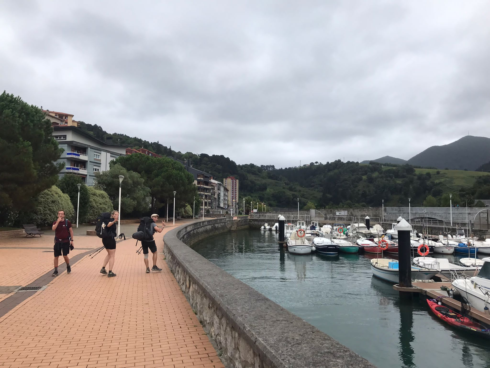

Je prends plaisir à alterner entre des périodes d'ouverture et d'autres, comme aujourd'hui, de repli. Exilé, à la manière d'un alchimiste, je tente tant bien que mal de transformer ces moments de partage, verbalisés ou non, en quelque chose de beau.

Tu vas peut-être me dire que j'entame 2024 de manière abstraite. Et je te donnerai raison. Mais c'est comme ça que j'avance, aujourd'hui. Beaucoup plus délesté que quelques années en arrière. Et malgré les moments difficiles, je suis plein d'espoir. Un espoir simple basé, entre autres, sur le fait que tout passe. Sur le fait que de belles choses arrivent toujours aux personnes qui écoutent ce que l'on appelle parfois voix intérieure, d'autres fois étincelle, d'autre fois même flamme. Ce qui nous anime au-delà du mental, du matériel. Une sorte de matière insaisissable qui nous fait dire, au fond du fond

> C'est juste.

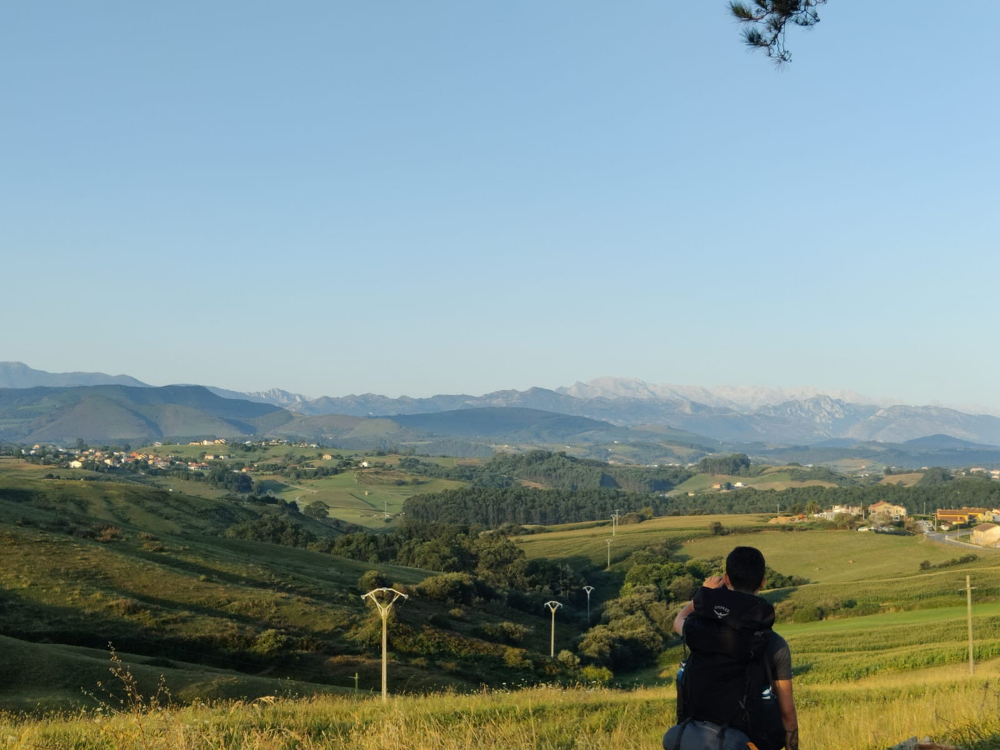

## Les p'tites réfs

- \[1\] Eckhart Tolle, [Le pouvoir du moment présent](https://www.babelio.com/livres/Tolle-Le-Pouvoir-du-moment-present--Guide-deveil-spiri/40054)
- \[2\] Fabrice Midal, ["Foutez-vous la paix !"](https://www.babelio.com/livres/Midal-Foutez-vous-la-paix-et-commencez-a-vivre/1262125)
