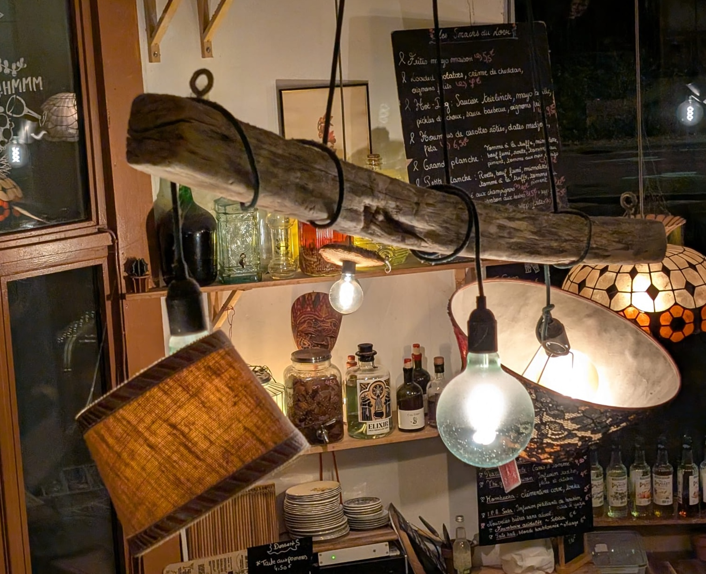
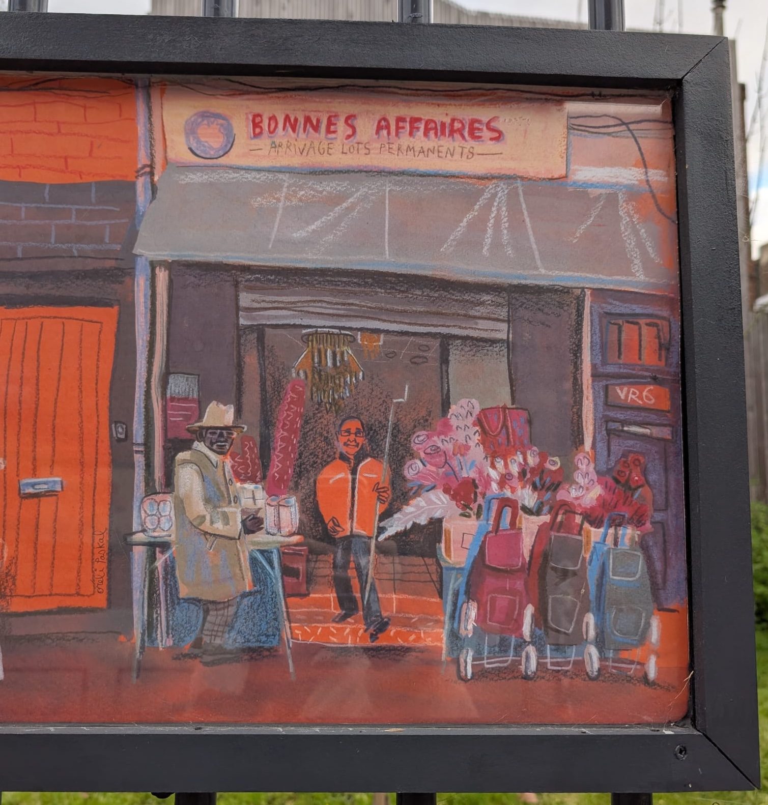
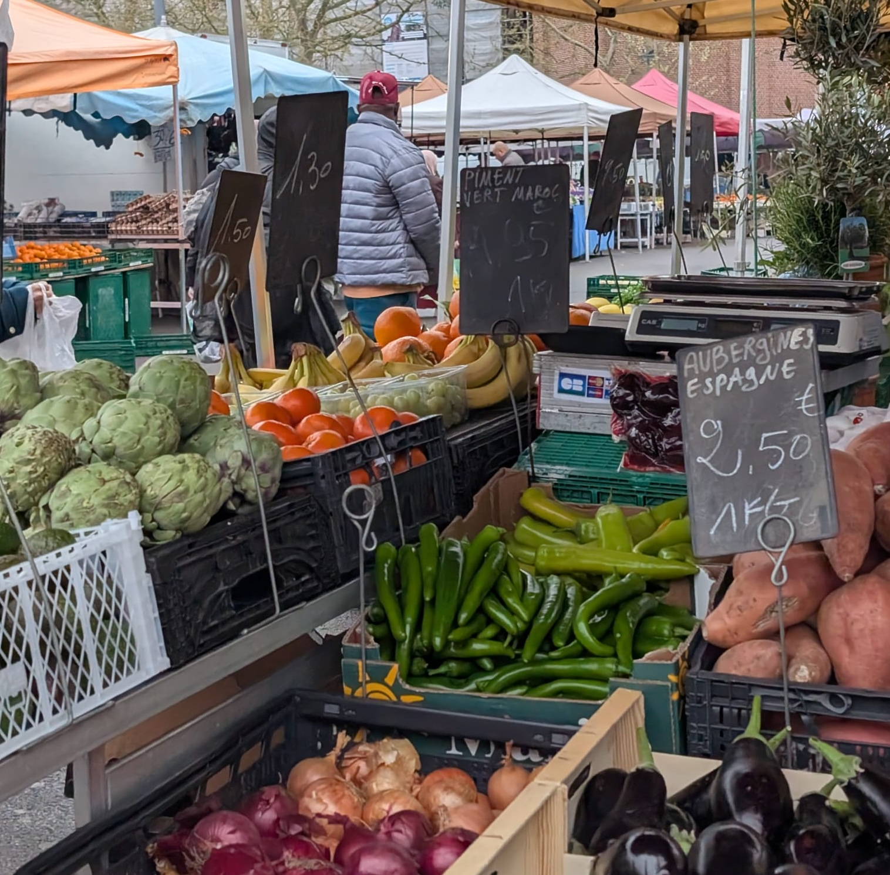

Toujours agréable de venir coucher ces mots-ci. Et pourtant pas si fréquent. Peut-être qu'il faut ce temps de disette pour en saisir de nouveau l'importance. En-dehors de toute distraction, ne faire qu'un avec soi. Je prends goût à ces sortes d'aller-retour. Devrais-je ? Aucune idée.

La feuille, en tout cas, accepte volontiers tout ce qu'on lui confie. Elle nous le garde jalousement, même. Des années, peu importe à quel moment on décide de lire la page à nouveau. Peut-être jamais, d'ailleurs.

Nous voici donc à quelques jours d'un nouveau voyage. Accompagné de ma partenaire favorite, chose pour laquelle je suis très reconnaissant.

Accompagné aussi des conflits intérieurs, des résistances, des démangeaisons de l'âme qui se comblent parfois par des moyens peu durables. Chocolat, café, bière sont mes béquilles. Que j'envie cet état dans lequel le vide suffit.

Parfois, j'ai l'impression que rien ne suffit. Qu'il faut toujours courir après quelque chose. Que si je m'arrête, je perds du temps. Ou encore pire, je rate. Je prends du retard sur ma mission de vie.

Et en même temps, va-t-on vraiment vers sa mission de vie quand on est obsédé par la destination ? Que l'on se presse, que l'on s'épuise ? Que l'on accomplit de manière frénétique en perdant de vue ce flux d'inspiration qui vient de l'intérieur ?

Après un retour vers soi, il est tellement facile de sombrer à nouveau dans la passivité de l'agitation du monde dans lequel on vit. Je le ferai d'ailleurs sûrement une fois ce texte écrit. Je me réfugierai à nouveau derrière des chimères de statut, de reconnaissance, d'accomplissements accessoires jusqu'à placer les signaux de mon propre élan vital en arrière-plan.

C'est là que commencent les ennuis. Quel dommage, en ayant la chance de vivre dans une époque où tout semble possible (pourvu que l'on soit du bon côté de la frontière). À commencer par prendre le temps d'aller vers soi. De "s'apprendre".

Peut-être que l'abondance de distractions transforme cette tâche complexe en parcours du combattant. Peut-être que le fait que nous ayons nous-mêmes transformé notre cadre de vie de telle sorte à ce qu'une quête aussi centrale que la quête de soi devienne une tâche si herculéenne en dit beaucoup sur nous.

À chercher à toute vitesse des signes extérieurs de développement, de progrès; en optimisant la moindre parcelle de notre temps pour laisser plus de place à souvent plus de travail; en brandissant contre tout problème une solution cartésienne; ne serions-nous pas en train de fuir l'essentiel ?

Les maux de notre temps : anxiété, solitude, individualisme, carences affectives, pillage des ressources, écarts de richesse exacerbés... ne viendraient-ils pas nous taper sur l'épaule pour nous montrer que ce qui a été mis sous le tapis est qu'une bombe à retardement ?

J'aime penser que c'est notre grande mission : revenir à soi. Pas le "soi" empris d'ego, qui cherche à s'illustrer individuellement pour bâtir un semblant d'estime; mais plutôt le "soi" qui vibre à une fréquence qui lui est propre. Un "soi" dont l'objectif n'est pas dicté par des attentes extérieures, dont il se moque d'ailleurs bien, mais plutôt le "soi" qui s'est en allé avec l'enfance. Le "soi" qui, sans raison, s'extasie devant un avion en papier parti pour un long voyage éphémère. Le "soi" dont l'odeur du gâteau au yaourt lui rappelle de bons souvenirs. Le "soi" qui s'autorise à s'amuser, à chanter, à rire. À vivre, finalement.

Et surtout, le "soi" qui rayonne l'amour autour de soi. Le "soi" conscient du fait qu'un regard, un sourire peut apporter beaucoup à la journée de son voisin. Le "soi" qui prend aussi le temps de l'écouter, ce voisin. Le "soi" qui s'enrichit de la différence avec ce voisin, car conscient qu'il n'y a pas de vision de la vie meilleure qu'une autre; simplement des pyramides de vécus, certaines plus stables que d'autres, construites par des personnes qui n'avaient ni les mêmes matériaux ni les mêmes techniques. Le "soi" sensible à l'influence que peut avoir et aux dégâts que peuvent provoquer ses comportements sur son propre habitat.

Il est grand temps d'élaguer. D'enlever les couches. De retirer, petit à petit, tous les artifices qui nous lestent et nous rendent captifs. Nous, qui avons délibérément choisi cette prison, avons aussi les moyens d'en sortir.
